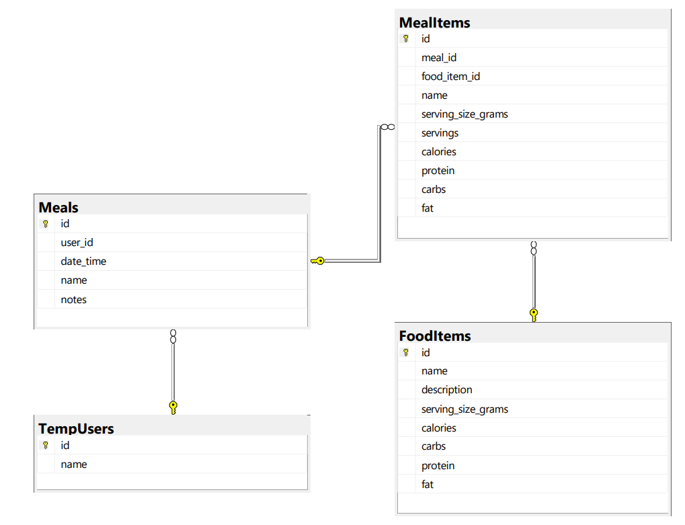

# 🍽️ Nutrition Tracker – Backend API

This is the ASP.NET Core Web API backend for the Nutrition Tracker app. It provides endpoints for meal logging, food item data, and nutritional calculations.

---

## 🚧 Status: Work in Progress

This project is part of my ongoing effort to develop full-stack skills. I'm currently focused on building functional API endpoints, integrating with the frontend, and learning RESTful service design best practices.

---

## 🧠 Learning Goals

- Build a RESTful API with ASP.NET Core
- Connect to a SQL Server database using Entity Framework Core
- Handle data validation and model binding
- Explore separation of concerns and clean API structure
- Practice full-stack integration with a React frontend

---

## 🛠️ Tech Stack

- **ASP.NET Core Web API**
- **C#**
- **Entity Framework Core**
- **SQL Server Express**
- **Swagger** for API testing

---

## 📦 Features (Planned / In Progress)

- [x] Get list of all food
- [x] Add new meal with food entries
- [x] Get all meals given a user id and date
- [ ] Calculate nutrition totals by day
- [ ] Authentication & user accounts
- [ ] Meal edit/delete endpoints
- [ ] Unit tests for controllers/services

---

## 🗃️ Database Schema


Database includes tables for:
- TempUsers (simple table with user id and name for testing until user authentication is implemented)
- Meals
- FoodItems
- MealItems (join table)

---

## 📸 Example Endpoints

- `GET /api/foods` – Search or list foods
- `GET /api/meals/{date}` – Get all meals by date
- `GET api/Meals/{user_id}/{date}/meals` - Get all meals by user id and date

---

## 🔗 Related

- [Nutrition Tracker – Frontend (React)](https://github.com/michaellintelman/nutrition-tracker-frontend)

---

## 🚀 Getting Started

1. Clone the repo:

```bash
git clone https://github.com/michaellintelman/nutrition-tracker-api.git
```

2. Navigate into the project:

```bash
cd nutrition-tracker-api
```

3. Set up the database connection in `appsettings.json`:

```json
"ConnectionStrings": {
  "DefaultConnection": "Server=localhost\SQLEXPRESS;Database=NutritionTrackerDb;Trusted_Connection=True;"
}
```

4. Run the project:

```bash
dotnet run
```

5. Use Swagger at `https://localhost:7284/swagger` to test endpoints

---

## 🙋‍♂️ About Me

I'm Michael Lintelman, a recent Computer Science graduate. This project is a key part of my journey into full-stack development using modern Microsoft and JavaScript technologies.